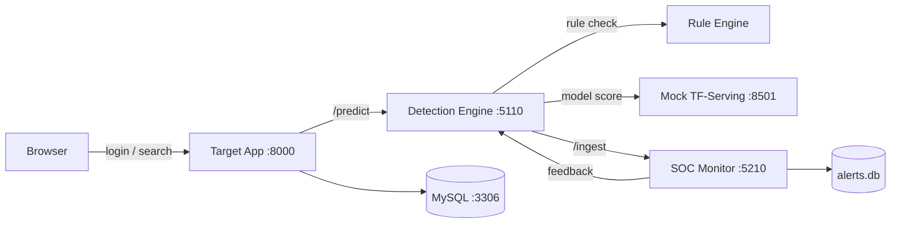

# SENTRY — Hybrid AI Web Application Firewall

A SQL Injection detection system that combines rule-based filtering with a
Bidirectional LSTM + Attention model, wrapped in an explainable-AI console
and a mini SOC with an adaptive feedback loop.

<!-- 📸 CHÈN ẢNH/GIF DEMO Ở ĐÂY — đây là thứ đầu tiên người xem thấy.
     Gợi ý: quay 15-20s màn hình gõ payload SQLi vào Target App, sang
     Detection Engine xem heatmap, rồi sang SOC Monitor xem alert xuất hiện. -->


[](https://www.python.org/)
[](https://docs.docker.com/compose/)
[](https://www.tensorflow.org/)
[](./LICENSE)
[](https://github.com/thanhsang1404/sqli-detection-waf/actions/workflows/ci.yml)

---

## The problem

Signature-based WAFs miss obfuscated SQL injection payloads
(`/**/OR/**/1=1--`, encoded `char()` tricks, blind timing attacks). Pure
ML-based detectors, on the other hand, are black boxes — a security analyst
can't tell *why* a request was flagged, which makes tuning and trust
difficult in production.

**SENTRY** addresses both: a rule engine catches obvious patterns instantly,
a trained model catches the subtle ones, and every decision comes back with
a token-level explanation.

## Architecture



Five containers, each with a single responsibility:

| Service | Port | Role |
|---|---|---|
| `web` | 8000 | Intentionally-vulnerable target app (demo attack surface) |
| `waf` | 5110 | Detection engine — hybrid rule + model, explainable API |
| `mock_tfserving` | 8501 | Stand-in for TensorFlow Serving |
| `soc` | 5210 | Alert store + adaptive threshold feedback |
| `db` | 3306 | MySQL, schema auto-provisioned via `db/init.sql` |

## What's technically interesting here

- **Hybrid detection** — a rule engine (tautology / comment / timing-attack
  patterns) runs first for near-zero-latency blocking on obvious payloads;
  a Bidirectional LSTM + Attention model (128-dim embeddings, ~31k training
  samples) catches everything else.
- **Explainable predictions** — `/explain` returns per-token attention
  weights, a 0-100 risk score, and the specific rules/tokens that drove the
  decision — not just a label.
- **Adaptive threshold via feedback loop** — analysts mark alerts as
  correct/incorrect in the SOC console; the WAF nudges its decision
  threshold up or down in response (`THRESHOLD ± 0.005–0.01`, bounded to
  `[0.5, 0.99]`). This is a lightweight feedback-control mechanism, not
  full reinforcement learning — no reward function or learned policy, by
  design, to keep the adjustment auditable and predictable.

## Quick start

```bash
git clone <your-repo-url>
cd SQLi_Detection_Project
cp .env.example .env        # set your own DB credentials
docker compose up -d --build
```

| Console | URL |
|---|---|
| Target App | http://localhost:8000 |
| Detection Engine | http://localhost:5110/demo |
| SOC Monitor | http://localhost:5210 |

Demo credentials (seeded by `db/init.sql`, for local demo only):
`admin` / `admin123`.

## Evaluation

Accuracy (~97%) is measured on a held-out split of the training
distribution (`training/test_datasets.py`, `training/evaluate_new_dataset.py`).
This number reflects performance on payloads *similar in style* to the
training data — it is not an adversarial benchmark. A more meaningful
signal came from manually fuzzing the live `/predict` endpoint through
Burp Suite Intruder with payloads outside the training set, which is the
recommended way to sanity-check the reported number rather than taking it
at face value.

## Known limitations

- Model evaluation hasn't been run against a fully independent, adversarial
  payload set yet — the ~97% figure should be read with that caveat.
- Two training pipelines currently coexist (`train_clean.py` and the
  "explicit" variant that's actually wired into production). This is a
  leftover from architecture experimentation and should be consolidated.
- The threshold feedback loop is a simple bounded increment, not a
  learned policy — see note above.
- `web/` is deliberately vulnerable (raw string-built SQL alongside
  parameterized queries) to give the WAF something real to catch. It is a
  target for the demo, not a reference for secure coding.

## Tech stack

Python · FastAPI · TensorFlow/Keras · Docker Compose · MySQL · SQLite

## License

MIT — see [THANHSANG](./THANHSANG).